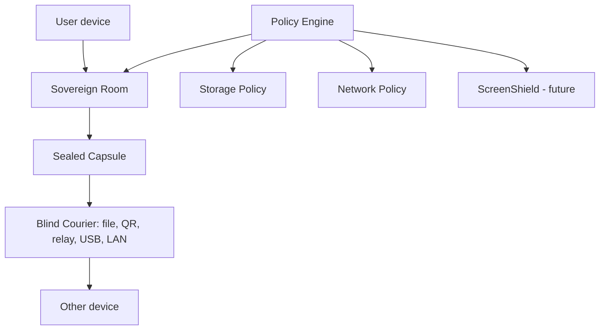

<picture>
  <source media="(prefers-color-scheme: dark)" srcset=".github/assets/freelayer-banner-dark.svg">
  <source media="(prefers-color-scheme: light)" srcset=".github/assets/freelayer-banner-light.svg">
  
</picture>

 

**Private rooms that live on your devices. Sealed capsules that travel any road. Privacy rules enforced by the app core — not by server promises.**

 

**[Plain-English overview](docs/PUBLIC_EXPLANATION.md)** · **[Wiki](https://github.com/XGiammyX/freelayer/wiki)** · **[Trust Center](docs/TRUST_CENTER.md)** · **[Roadmap](docs/ROADMAP.md)** · **[All docs](docs/README.md)**

> [!WARNING]
> **Foundation stage — not ready for real secrets.** No release, no implemented cryptography, no messaging yet. What exists today: a locked architecture constitution (12 ADRs), a policy-enforced storage layer with 78 green tests, and mechanical privacy guardrails on every commit. The [Trust Center](docs/TRUST_CENTER.md) tells you exactly what is and isn't real.

---

## 🧭 The problem

Most communication tools force you to trust a central service. Even with encrypted messages, you usually still expose **accounts · phone numbers · servers · metadata · online status · screenshots · cloud workspaces**. And the moment real collaboration starts — documents, tasks, decisions — it escapes to cloud tools that read everything.

**What if private communication were built around user-owned rooms and sealed objects, instead of company-owned servers?**

## 💡 The idea in one minute

1. You create a **private room** — it lives on the members' devices, not on anyone's server.
2. Every update becomes a **sealed capsule** — a digital envelope.
3. Capsules travel through **any courier**: an internet relay, a shared folder, a QR code, a USB stick.
4. **The courier can't read them.** If one road is blocked, take another.
5. The **policy engine in the app core** decides what may be stored, sent, previewed, copied or shown — rules a UI bug can't skip.
6. **ScreenShield** (planned) keeps caring *after* decryption: screenshots, clipboard, recording, risky devices.

> [!TIP]
> **Think of a capsule like a sealed envelope.** A courier can carry it. A folder can store it. A QR code can move it. A USB drive can transport it. A relay can hold it for a while. But the courier is never trusted with the letter inside.

## 🧱 Core ideas

| | Idea | Simple meaning |
|---|------|----------------|
| 🏠 | **Sovereign Rooms** | Private workspaces on your devices — chat, notes, documents, tasks, decisions |
| ✉️ | **Capsules** | Sealed digital envelopes for everything that travels between devices |
| 📦 | **Blind Courier** | Any transport can carry capsules — none can read them |
| ⚖️ | **Policy Engine** | Core rules that block unsafe storage, network, previews, AI or copy actions |
| 🪪 | **Identity Firewall** | No phone number, no email, no central account — ever |
| 🌫️ | **Metadata Firewall** | Fewer silent leaks: typing, read receipts, presence, link previews |
| 🛡️ | **ScreenShield** | Endpoint protection developed as a **separate standalone project** — FreeLayer core keeps policy hooks only; nothing is active in core yet |
| 🧊 | **Ghost Vault** | Planned mode keeping identity keys on an offline device |

Every term, honestly labeled with its real status → **[Glossary](docs/GLOSSARY.md)**

## ⚖️ Honest by design

| ❌ FreeLayer is not… | ✅ …it is |
|---|---|
| Production software or a Signal replacement today | A research-stage architecture, built slowly and in public |
| A blockchain or token project | Decentralized as in *no required infrastructure* — no chain, no coin, ever |
| A cloud workspace or SaaS | Rooms that live on members' devices, synced by sealed capsules |
| A promise of perfect anonymity | An honest threat model that states its limits first |
| A magic anti-spyware layer | ScreenShield reduces capture risk — and says exactly where it can't |

## 📊 Status at a glance

| Area | Status | | Area | Status |
|---|---|---|---|---|
| Public repo | 🟢 Live | | Messaging | ⚪ Not implemented |
| CI + privacy guards | 🟢 Green on every commit | | Real networking | ⚪ Not implemented |
| Storage policy layer | 🟢 Implemented + 78 tests | | Local AI | ⚪ Not implemented |
| App | 🟡 Foundation shell only | | ScreenShield | 🔷 Externalized (hooks only in core) |
| Crypto | ⚪ Deliberately not yet | | **Safe for real secrets** | 🔴 **No** |

## 🗺️ Roadmap

**1.** Foundation & public repo ✅ → **2.** Policy engine *(matrix + conflict suite ✅)* → **3.** Storage/network/metadata guardrails ✅ → **4.** Endpoint defense / ScreenShield *(research ✅ — implementation **externalized** to a standalone project; core keeps hooks; integration via a dedicated gate)* → **5.** Identity without phone/email → **6.** Encrypted capsules → **7.** Messaging MVP → **8.** Sovereign Rooms → **9.** Documents & files → **10.** Local AI → **11.** Security hardening → **12.** Alpha

No dates, deliberately — [gates](docs/IMPLEMENTATION_GATES.md), not schedules, decide when implementation may start. Full detail: **[Roadmap](docs/ROADMAP.md)**

## 🔍 Compared simply

> [!NOTE]
> This explains FreeLayer's **design direction** — it is not an attack on other projects, many of which are excellent, audited software you can use today. FreeLayer is not implemented yet, so no row claims it is better now.

| Tool / category | Great at | Simple trade-off | FreeLayer direction |
|---|---|---|---|
| Signal | Mature encrypted messaging | Central service model | No required server at all |
| WhatsApp / Telegram-like | Easy mainstream messaging | Account/platform trust is central | User-owned local rooms |
| Matrix | Powerful rooms & federation | Homeservers are core infrastructure | Rooms without homeservers |
| SimpleX | No user identifiers | Relay/queue model is central | Relays are just one optional courier |
| Briar | Offline/P2P resilience | Limited as a workspace | Offline thinking + full rooms |
| Nostr clients | Simple relay ecosystem | Public/metadata-heavy by design | Private sealed capsules by default |
| Reticulum/LXMF | Transport-agnostic networking | Technical ecosystem | Same freedom, usable room platform |
| Slack / Notion / Docs | Great cloud collaboration | The cloud reads everything | Local-first operational rooms |

Deeper: **[readable comparison](docs/PUBLIC_COMPARISON.md)** · **[research-grade comparison](docs/COMPETITOR_COMPARISON.md)**

## 🏗️ Under the hood

Every side effect follows one pipeline — **validate → classify → resolve policies → strictest wins → `PolicyDecision` → execute → audit** — and apps can't call storage, transports, crypto or AI directly (import boundaries fail CI). The binding decisions live as [Architecture Decision Records](docs/adr/README.md); implementation is blocked behind explicit [gates](docs/IMPLEMENTATION_GATES.md).

<b>📚 Key technical documents</b>

 

- [Architecture](docs/ARCHITECTURE.md) — layering, the 15 non-bypassable rules, the operation pipeline
- [Threat Model](docs/THREAT_MODEL.md) — attackers, assets, and what FreeLayer honestly can't protect against
- [Privacy Model](docs/PRIVACY_MODEL.md) — seven privacy modes, strictest-policy-wins
- [Storage Model](docs/STORAGE_MODEL.md) — the write barrier: nothing persists without policy approval
- [CapsuleNet](docs/CAPSULENET.md) — sealed capsules and hostile-input parsing
- [Sovereign Rooms](docs/SOVEREIGN_ROOMS.md) — rooms as private operational spaces
- [Endpoint Defense / ScreenShield](docs/ENDPOINT_DEFENSE_MODEL.md) — data-on-screen protection design
- [PBOM](docs/PBOM.md) — the Privacy Bill of Materials: everything the software actually does

## 🔐 Security philosophy

**Honest threat model** — the docs state what FreeLayer *cannot* do (compromised devices, malicious members, global traffic analysis, cameras) before what it aims to do. **No forbidden claims** — "unbreakable", "perfect anonymity", "forensic erasure" and "spyware-proof" are review-blockers, permanently. **Everything hostile until proven otherwise** — transports are blind, all external input is parsed strictly, policy bypass is treated as a top-level threat. **Docs and tests move with code** — same-PR coupling, enforced in review and CI.

## 🤝 Contributing

We are building slowly, because privacy software should not be rushed. Right now, **research and verification are as valuable as code** — a perfect first PR is checking one comparison row against official docs.

**[Contributor workflow](docs/CONTRIBUTOR_WORKFLOW.md)** *(start here — `pnpm check:all` before every PR)* · **[Contributor tasks](docs/CONTRIBUTOR_TASKS.md)** · **[Contributing guide](CONTRIBUTING.md)** · **[Security-sensitive rules](docs/CONTRIBUTING_SECURITY.md)** · **[Trust Center](docs/TRUST_CENTER.md)** · **[PBOM](docs/PBOM.md)** · **[Report a vulnerability](SECURITY.md)** *(privately, please)*

Hard lines every PR must respect: no telemetry · no external assets · no custom crypto · no policy bypass — CI enforces the mechanical parts.

---

**Code [AGPL-3.0-or-later](LICENSE) · Docs [CC BY-SA 4.0](docs/LICENSE-DOCS.md)** — so privacy-weakening closed forks are license violations ([why](docs/adr/ADR-0011-license-strategy.md))

*Built slowly, on purpose. Every limitation written down before every feature.*

