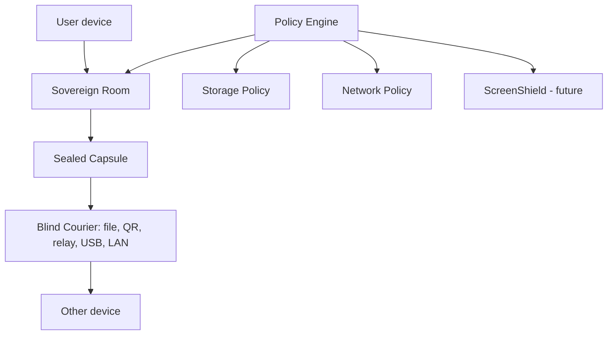

# FreeLayer

**Private communication without a central server.**

FreeLayer is an open-source project exploring a new kind of communication platform: private rooms that live on your devices, sealed capsules that can move through any transport, and privacy rules enforced by the app core instead of hidden server trust.

> ⚠️ **FreeLayer is in foundation stage. It is not ready for real secrets yet.**

**New here?** Start with [FreeLayer in plain English](docs/PUBLIC_EXPLANATION.md) · [Trust Center](docs/TRUST_CENTER.md) · [Roadmap](docs/ROADMAP.md) · [Docs index](docs/README.md)

---

## The problem

Most communication tools force you to trust a central service. Even when messages are encrypted, you often still expose:

**accounts** · **phone numbers** · **email addresses** · **servers** · **metadata** · **online status** · **device notifications** · **screenshots** · **cloud storage** · **workspace history**

And the moment real collaboration starts — documents, tasks, decisions — it usually moves to cloud tools that see everything.

**What if private communication was built around user-owned rooms and sealed objects instead of company-owned servers?**

## The idea in one minute

- You create a **private room**.
- Your room data **lives locally**, on the members' devices.
- Every update becomes a **sealed capsule**.
- Capsules can move through **different couriers** — a relay, a file, a QR code, a USB drive, a local network.
- The **courier cannot read them**.
- The **app policy decides** what can be stored, sent, previewed, copied or shown — the rules live in the core, not in a settings screen a bug can skip.
- A future layer called **ScreenShield** protects sensitive content *after* it is decrypted — screenshots, clipboard, screen recording, risky devices.

## The simple analogy

Think of a capsule like a **sealed envelope**.

A courier can carry it.
A folder can store it.
A QR code can move it.
A USB drive can transport it.
A relay can hold it temporarily.

But the courier is not trusted with the letter inside.

## Core ideas

| Idea | Simple meaning |
| --- | --- |
| Sovereign Rooms | Private workspaces that live on your devices |
| Capsules | Sealed digital envelopes |
| Blind Courier | Any transport that carries capsules without reading them |
| Policy Engine | Rules that block unsafe storage, network, previews, AI or copy actions |
| Identity Firewall | No required phone number, email or central account |
| Metadata Firewall | Fewer leaks like typing, read receipts, presence and link previews |
| ScreenShield | Future protection for screenshots, clipboard and risky devices |
| Ghost Vault | Future mode for keeping identity keys offline |

Simple definitions for every term: [docs/GLOSSARY.md](docs/GLOSSARY.md)

## What FreeLayer is not

- Not production software yet — there is no release.
- Not a Signal replacement today.
- Not a blockchain project. No tokens, ever.
- Not a SaaS. Not a cloud workspace.
- Not a promise of perfect anonymity.
- Not a promise to defeat compromised devices.
- Not a magic anti-spyware solution.

## What makes it different

- Most messengers are built around a **network**. FreeLayer is built around **sealed objects**.
- Most collaboration tools store rooms in the **cloud**. FreeLayer aims for rooms that **live on devices**.
- Most apps treat screenshot/clipboard/device exposure as somebody else's problem. FreeLayer adds **ScreenShield** as a planned endpoint-defense layer.
- Most apps expose identifiers. FreeLayer avoids **phone/email login by design**.

## Status

| Area | Status |
| --- | --- |
| Public repo | Live |
| App | Foundation shell only |
| Crypto | Not implemented |
| Messaging | Not implemented |
| Real networking | Not implemented |
| AI | Not implemented |
| ScreenShield | Design/research |
| Security audit | None |
| **Safe for real secrets** | **No** |

The full honest answer lives in the [Trust Center](docs/TRUST_CENTER.md).

## Roadmap summary

1. Foundation and public repo ✅
2. Policy engine
3. Storage/network/metadata guardrails
4. Endpoint defense / ScreenShield *(research done ✅ — implementation later)*
5. Identity without phone/email
6. Encrypted capsules
7. Messaging MVP
8. Sovereign Rooms
9. Documents/files
10. Local AI
11. Security hardening
12. Alpha

Detailed tracks and gates: [docs/ROADMAP.md](docs/ROADMAP.md) · [docs/IMPLEMENTATION_GATES.md](docs/IMPLEMENTATION_GATES.md)

## Compared simply

> This comparison explains FreeLayer's design direction. It is not an attack on other projects — many of them solve hard problems brilliantly and inspire FreeLayer. **FreeLayer is not implemented yet**, so no row claims FreeLayer is better today.

| Tool / category | What it is great at | Simple trade-off | FreeLayer direction |
| --- | --- | --- | --- |
| Signal | Mature encrypted messaging | Still depends on a central service model | No required FreeLayer server |
| WhatsApp / Telegram-like apps | Easy mainstream messaging | Account/server/platform trust is central | User-owned local rooms |
| Matrix | Powerful rooms and federation | Homeservers are still core infrastructure | Rooms without homeservers |
| SimpleX | Strong no-identifier thinking | Relay/queue model is central | Relays are optional couriers, not the whole system |
| Briar | Offline/P2P resilience | More limited as a workspace | Offline thinking plus rooms, docs, tasks and decisions |
| Nostr clients | Simple relay ecosystem | Often public/metadata-heavy by design | Private sealed capsules by default |
| Reticulum/LXMF | Transport-agnostic networking | Technical ecosystem | Bring transport-agnostic ideas into a usable room platform |
| Slack/Notion/Google Docs | Great cloud collaboration | Workspace data lives in cloud services | Private local-first operational rooms |

For a deeper comparison, see [docs/PUBLIC_COMPARISON.md](docs/PUBLIC_COMPARISON.md) (readable) and [docs/COMPETITOR_COMPARISON.md](docs/COMPETITOR_COMPARISON.md) (research-grade).

---

## Technical architecture

For the technically curious — the deep documents live in [docs/](docs/README.md).

Every side-effectful operation follows one pipeline: **validate → classify → resolve policies → strictest policy wins → `PolicyDecision` → execute → audit**. Apps never call storage, transports, crypto, or AI directly — enforced today by import-boundary checks in CI, with the binding rules recorded as [Architecture Decision Records](docs/adr/README.md) (the project constitution) and implementation blocked behind explicit [gates](docs/IMPLEMENTATION_GATES.md).

Key technical documents: [Architecture](docs/ARCHITECTURE.md) · [Threat Model](docs/THREAT_MODEL.md) · [Privacy Model](docs/PRIVACY_MODEL.md) · [CapsuleNet](docs/CAPSULENET.md) · [Sovereign Rooms](docs/SOVEREIGN_ROOMS.md) · [Endpoint Defense](docs/ENDPOINT_DEFENSE_MODEL.md) · [PBOM](docs/PBOM.md)

## Security philosophy

- **Honest threat model** — [docs/THREAT_MODEL.md](docs/THREAT_MODEL.md) states what FreeLayer does *not* protect against: compromised devices, malicious room members, global traffic analysis, cameras pointed at screens.
- **No perfect-anonymity claims. No unbreakable-encryption claims. No forensic-erasure claims. No spyware-proof claims.** Ever.
- **Transports are hostile.** All external input is hostile input, parsed strictly with fuzz tests required before production.
- **Policy bypass is a top-level threat** — a feature skipping core policy is treated as an attack class.
- **Docs and tests must change with code** — same-PR coupling, enforced in review.

## For contributors

We are building slowly, because privacy/security software should not be rushed.

- **Research before code. Docs before implementation.** Tests and docs land in the same PR.
- Hard lines every PR must respect: **no custom crypto, no telemetry, no external assets, no policy bypass** — CI enforces the mechanical parts.
- Security-sensitive PRs follow stricter rules: [CONTRIBUTING.md](CONTRIBUTING.md) · [docs/CONTRIBUTING_SECURITY.md](docs/CONTRIBUTING_SECURITY.md)
- Want to help right now? Pick a task from [docs/CONTRIBUTOR_TASKS.md](docs/CONTRIBUTOR_TASKS.md) — research and doc verification are as valuable as code today.
- FreeLayer wants contributors, but it does not want reckless security claims — honest language is a review criterion.
- Report vulnerabilities privately: [SECURITY.md](SECURITY.md)

## License

- **Code:** [AGPL-3.0-or-later](LICENSE)
- **Documentation:** [CC BY-SA 4.0](docs/LICENSE-DOCS.md) unless otherwise stated

Rationale: [ADR-0011](docs/adr/ADR-0011-license-strategy.md). Not legal advice; the license texts are authoritative.
