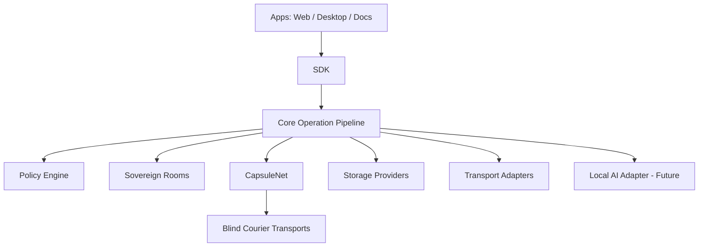

# FreeLayer

**Serverless private communication. Sovereign rooms. Encrypted capsules. No central backend.**

FreeLayer is an open-source, local-first communication platform where conversations can become private operational rooms and every cross-device object can travel as an encrypted capsule through any transport.

> ⚠️ **FreeLayer is in foundation stage. Do not use it for real secrets yet.**
> There is no release, no implemented cryptography, and no product feature. What exists today: a locked architecture constitution, a typed monorepo, and mechanical privacy guardrails.

License: **AGPL-3.0-or-later** (code) · **CC BY-SA 4.0** (docs)

---

## Why FreeLayer exists

- Normal messengers are mostly **message streams** — real collaboration escapes to cloud tools that see everything.
- Privacy tools often depend on **one specific network or relay design**, and stop where that network stops.
- **Metadata is often ignored**: content gets encrypted while receipts, presence, timing, and previews keep talking.
- **Local-first collaboration and private communication are usually separate worlds.**

FreeLayer's bet:

**FreeLayer combines private messaging, local-first rooms, transport-agnostic capsules and core-enforced privacy policies into one architecture.**

## Core pillars

| Pillar | What it means |
| --- | --- |
| Sovereign Rooms | Encrypted local-first rooms for chat, notes, documents, tasks, decisions and files |
| CapsuleNet | Encrypted capsules that can move through any byte-carrying medium |
| Blind Courier | Transports carry ciphertext without being trusted |
| Policy Engine | Side effects require a core `PolicyDecision` |
| Identity Firewall | No phone, no email, no central account |
| Metadata Firewall | Typing, receipts, presence, previews and assets are policy-controlled |
| Ghost Vault | Future offline identity mode |
| Local AI | Future local-only AI, disabled by default |

## What makes FreeLayer different

**Most messengers are built around a network. FreeLayer is built around encrypted objects and policy-controlled rooms.**

- **No required FreeLayer server** — the project runs no infrastructure you must trust; if every relay disappeared, capsules still move over files, QR, USB, and LAN.
- **No central account, no mandatory phone/email** — identity is local ([ADR-0001](docs/adr/ADR-0001-no-project-owned-infrastructure.md)).
- **Local-first state** — your devices hold the authoritative data.
- **Transport-agnostic capsules** — one sealed format for everything that crosses a device boundary ([ADR-0003](docs/adr/ADR-0003-capsules-as-only-cross-device-format.md)).
- **Strict policy engine** — a UI bug must not be able to leak what the core refuses to release ([ADR-0002](docs/adr/ADR-0002-core-enforced-policy-engine.md)).
- **Sovereign Rooms beyond chat** — documents, tasks, decisions, and room memory as first-class encrypted objects.
- **Honest security model** — every design document states what it does **not** protect against.

## How FreeLayer compares

> This comparison explains FreeLayer's design choices. It is not an attack on other projects; many of them solve hard problems and inspire FreeLayer. FreeLayer is **not implemented yet** — rows describe design direction, not a claim of being better today. Details and caveats: [docs/PUBLIC_COMPARISON.md](docs/PUBLIC_COMPARISON.md).

| Platform | Strength | Trade-off | FreeLayer direction |
| --- | --- | --- | --- |
| Signal | Mature E2EE and strong UX | Central service and phone-number roots historically | No required central backend or phone/email identity |
| SimpleX | Strong no-identifier design | Relay/queue model complexity | Learn from identifier minimization; add transport-agnostic capsules |
| Session | No phone number and onion-style routing | Depends on its service-node network | No required network; any transport can carry capsules |
| Briar | Offline/P2P resilience | More limited mainstream workspace model | Combine offline thinking with Sovereign Rooms |
| Matrix | Powerful rooms and ecosystem | Homeserver-based architecture | Local-first rooms without homeservers |
| Nostr clients | Simple relay ecosystem | Public-first/event metadata trade-offs | Private-by-default sealed capsules |
| Reticulum/LXMF | Deep transport-agnostic networking | More technical ecosystem | Bring transport-agnostic philosophy into UX-first rooms |
| Quiet | Serverless team collaboration direction | Tor-specific architecture | Multi-transport rooms and capsules |
| Keet/Holepunch | Direct P2P sync | P2P availability/NAT/IP trade-offs | Transport choice governed by policy |
| Magic Wormhole | Excellent one-time transfer UX | Not persistent rooms/messaging | Learn from simple transfer UX for invites/capsules |

## Architecture overview

Every side-effectful operation follows one pipeline: **validate → classify → resolve policies → strictest policy wins → `PolicyDecision` → execute → audit**. Apps never call storage, transports, crypto, or AI directly — enforced today by baseline import-boundary checks in CI, with stronger mechanical enforcement tracked in [docs/IMPLEMENTATION_GATES.md](docs/IMPLEMENTATION_GATES.md).

## Current status

- **Foundation stage.** Architecture constitution (11 ADRs), typed monorepo (12 packages, 4 app shells), mechanical guardrails in CI.
- **No release.** No installable product exists.
- **No cryptography implemented** — deliberately blocked until design review ([ADR-0004](docs/adr/ADR-0004-no-crypto-implementation-before-review.md)); the only crypto provider throws.
- **No chat, no real networking, no AI yet.** The AI provider rejects by design; no transport performs I/O.
- **Not safe for real secrets** — and it will say so until verified reality changes ([docs/TRUST_CENTER.md](docs/TRUST_CENTER.md)).
- Policy-engine and guardrail work is in progress; GitHub is the development platform only — **the FreeLayer runtime has no GitHub dependency and no required hosted service of any kind**.

## Roadmap

1. Foundation and governance ✅
2. Monorepo and mechanical guardrails ✅ *(in progress — desktop shell pending)*
3. Policy Engine
4. Storage/Network/Metadata enforcement
5. Identity Firewall
6. CapsuleNet
7. Messaging MVP
8. Sovereign Rooms
9. Documents and files
10. Local AI
11. Hardening and security automation
12. Alpha release

Full detail: [docs/ROADMAP.md](docs/ROADMAP.md) · gates that block implementation: [docs/IMPLEMENTATION_GATES.md](docs/IMPLEMENTATION_GATES.md)

## Security philosophy

- **Honest threat model** — [docs/THREAT_MODEL.md](docs/THREAT_MODEL.md) states what FreeLayer does *not* protect against: compromised devices, malicious room members, global traffic analysis.
- **No perfect-anonymity claims. No unbreakable-encryption claims. No forensic-erasure claims.** Ever.
- **Transports are hostile** — blind couriers carrying ciphertext, trusted with nothing.
- **All external input is hostile input** — capsules, room operations, documents, file metadata, QR payloads; strict parsing with fuzz tests required before production ([docs/CAPSULENET.md](docs/CAPSULENET.md)).
- **Policy bypass is a top-level threat** — a feature skipping core policy is treated as an attack class, with layered mitigations.
- **Docs and tests must change with code** — same-PR coupling, enforced in review ([ADR-0010](docs/adr/ADR-0010-documentation-updated-with-code.md)).

## Contributing

Research before code. Design before implementation. Tests and docs required in the same PR.

- Start with [CONTRIBUTING.md](CONTRIBUTING.md); security-sensitive areas follow stricter rules in [docs/CONTRIBUTING_SECURITY.md](docs/CONTRIBUTING_SECURITY.md) and the [security review checklist](docs/SECURITY_REVIEW_CHECKLIST.md).
- Hard lines every PR must respect: **no telemetry, no external assets, no custom crypto, no policy bypass** — CI enforces the mechanical parts.
- Right now, design review and research contributions (threat model critique, comparison verification, CRDT/crypto research) are as valuable as code.
- Report vulnerabilities privately: [SECURITY.md](SECURITY.md).

## License

- **Code:** [AGPL-3.0-or-later](LICENSE)
- **Documentation:** [CC BY-SA 4.0](docs/LICENSE-DOCS.md) unless otherwise stated
- **Protocol test vectors / spec fragments:** TODO — CC0 under evaluation for interoperability ([ADR-0011](docs/adr/ADR-0011-license-strategy.md))

## Learn more

- [docs/ARCHITECTURE.md](docs/ARCHITECTURE.md) — layering, non-bypassable rules, operation pipeline
- [docs/THREAT_MODEL.md](docs/THREAT_MODEL.md) — assets, attackers, honest limitations
- [docs/PRIVACY_MODEL.md](docs/PRIVACY_MODEL.md) — privacy modes and the strictest-wins rule
- [docs/CAPSULENET.md](docs/CAPSULENET.md) — capsules and hostile-input parsing
- [docs/SOVEREIGN_ROOMS.md](docs/SOVEREIGN_ROOMS.md) — RoomOS design
- [docs/PROJECT_POSITIONING.md](docs/PROJECT_POSITIONING.md) — what FreeLayer is and is not
- [docs/TRUST_CENTER.md](docs/TRUST_CENTER.md) — how much to trust FreeLayer right now (answer: design only)
- [docs/PBOM.md](docs/PBOM.md) — Privacy Bill of Materials
- [docs/ROADMAP.md](docs/ROADMAP.md) — phases and exit criteria
- [docs/CONTRIBUTING_SECURITY.md](docs/CONTRIBUTING_SECURITY.md) — rules for security-sensitive changes
