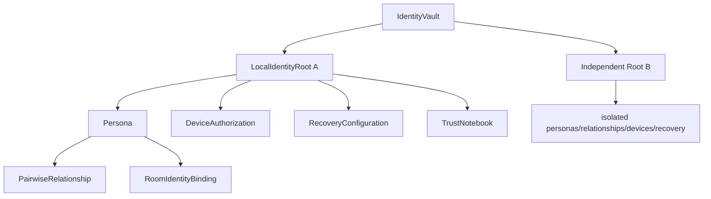
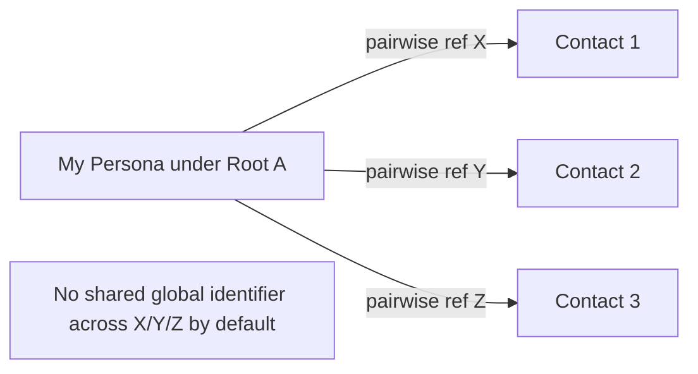
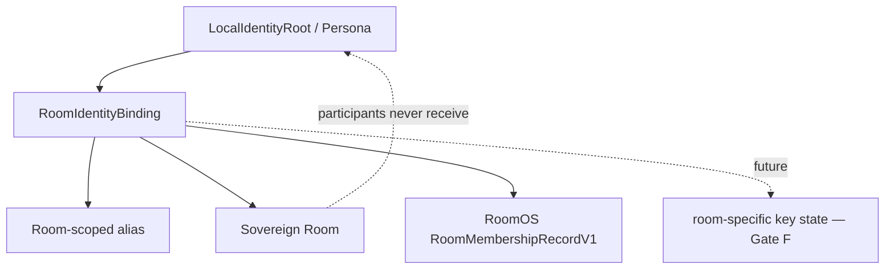
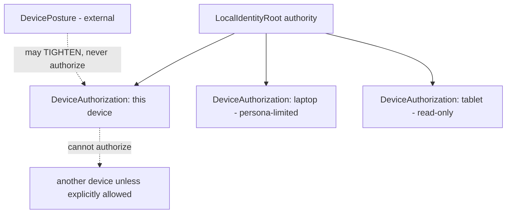
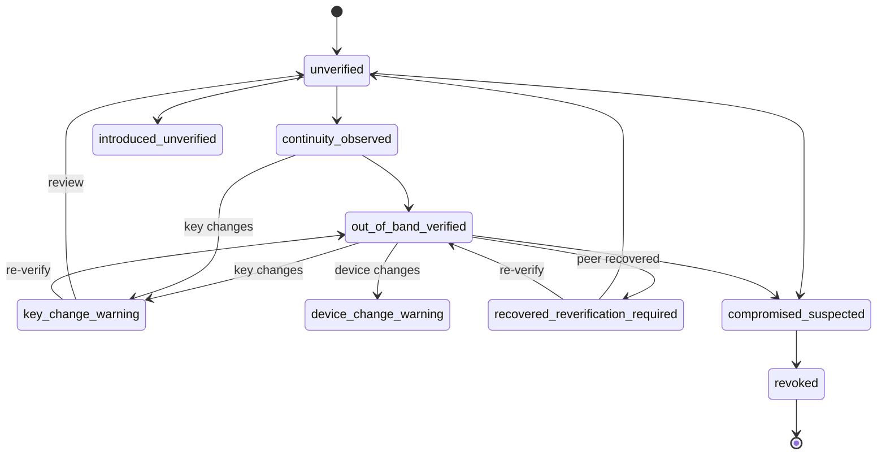
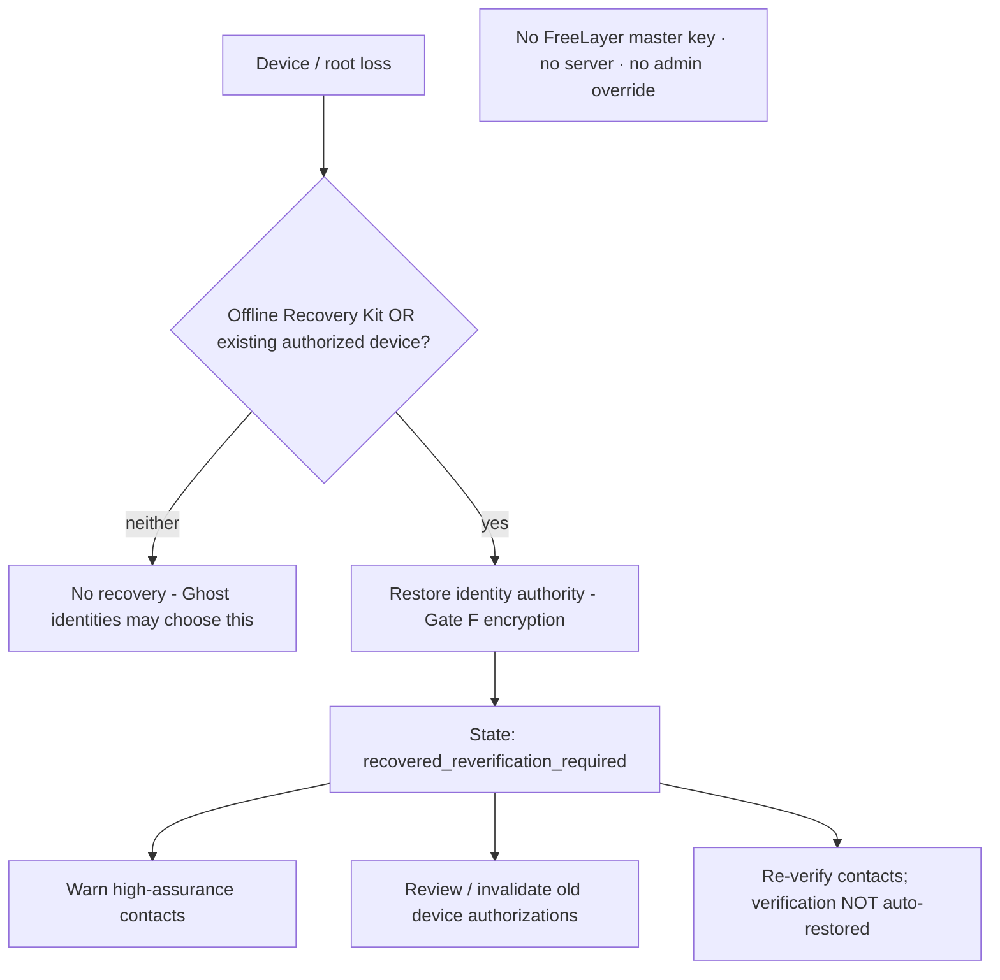
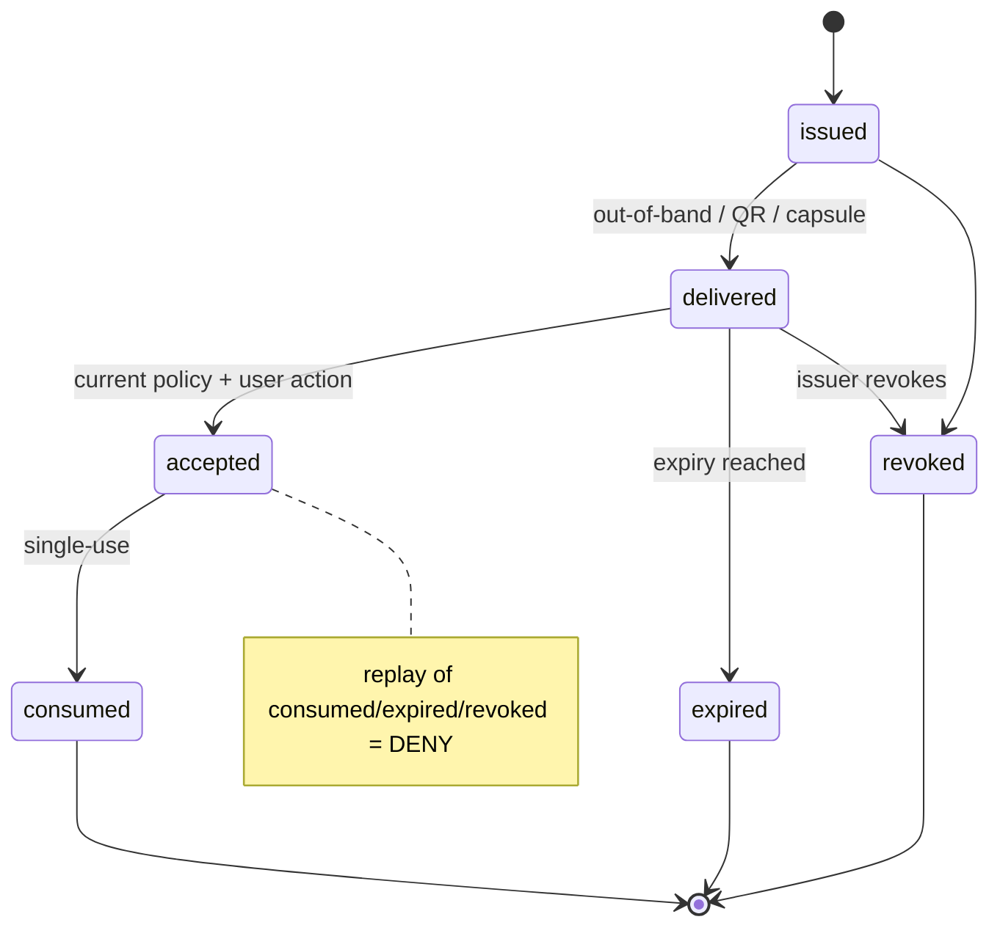
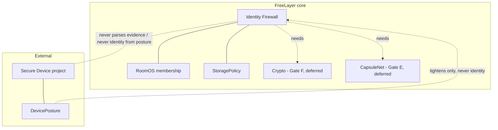

# Identity Architecture (Identity Firewall)

> **Status: local scaffolding implemented ([TECH-ID-03](adr/ADR-0013-identity-firewall-architecture.md)); NO cryptography.** `@freelayer/identity` now provides **local, non-cryptographic, metadata-only** roots/personas/relationships/room-bindings with lifecycle validators, policy-gated commands, a pure reducer, and memory/null repositories. Still **not implemented**: identity keys/signatures/derivation/fingerprints (Gate F), per-contact/per-room aliases (TECH-ID-05/06), device keys/passports (TECH-ID-07/08), Trust Notebook (TECH-ID-09), invites/QR (TECH-ID-10/11, Gate E), recovery (TECH-ID-12/13), synchronization (Gate H), DID, key transparency, verified identity. Diagrams below label future components; none imply implemented crypto. Normative companion to ADR-0013.

## Invariants (from ADR-0013 §8-equivalent)

No phone/email required · no central identity database · no universal public account identifier · the private root is never a normal peer-facing identifier · no global root public key reused across unrelated relationships by default · pairwise identifiers are relationship-scoped · room aliases are room-scoped · display profiles are separate from identity authority · profile names/avatars are never verification · `RoomMemberRef` is not identity · DevicePosture is not identity · a device is not a person · device authorization is subordinate to identity authority · every device has independent future key material · recovery never creates an admin backdoor · no project-owned master recovery key · recovery affects assurance visibly · verification states describe specific claims · verification never silently survives incompatible key/root changes · trust records are local observations · blocking binds to a relationship record, not an alias · one-time invites are narrow/expiring/revocable · unknown identity states fail closed · identity secrets are never logged · Ghost/Bunker storage restrictions apply · Secure Device remains a separate environmental input.

## Logical entities (non-implementational type appendix)

> These are **architecture sketches**, not production interfaces. TECH-ID-03 defines the real, versioned, local types. No field here implies crypto or persistence.

```
IdentityVault          { schemaVersion; roots: LocalIdentityRoot[]; independent: true }
LocalIdentityRoot      { schemaVersion; rootRefLocal (private); lifecycleState; personas; devices; recovery; trustNotebook }
Persona                { schemaVersion; localLabel; avatarRefLocal?; defaultProfile; defaultPolicy; roomAliasDefaults; unlinkable: false }
PairwiseRelationship   { schemaVersion; localContactRef; peerFacingPairwiseRef; presentation; trustState; blockState; keyContinuityState_future }
RoomIdentityBinding    { schemaVersion; rootOrPersonaRef; roomLocalId; roomAlias; membershipRef; roomKeyState_future }
DeviceAuthorization    { schemaVersion; deviceRefLocal; scope; authState; deviceKeyState_future }
TrustNotebook          { schemaVersion; records: TrustRecord[] }
TrustRecord            { schemaVersion; kind (fact|peer_claim|local_note); event; channel?; observedAtLocal }
RecoveryConfiguration  { schemaVersion; mode (offline_kit|existing_device|none); policy; assuranceOnRecovery: "recovered_reverification_required" }
InviteAuthority        { schemaVersion; class; issuerContext; targetPersonaOrRoom; maxAuthority; expiry; singleUseState; revocationState; recipientBinding? }
IdentityPolicy         { schemaVersion; failClosed: true; strictModeMinimization; ghostBunkerRestrictions }
```

## Diagram 1 — Identity entity graph



## Diagram 2 — Pairwise relationship model



Each contact gets a distinct peer-facing pairwise identifier; none is reused; the display alias can change without changing the relationship record; **block state survives alias changes**.

## Diagram 3 — Room identity binding



## Diagram 4 — Root-to-device authorization hierarchy



## Diagram 5 — Verification & warning state transitions



## Diagram 6 — Recovery flow



## Diagram 7 — Invite lifecycle



## Diagram 8 — Identity Firewall boundary



## Identity-root lifecycle (state table — not implemented)

| State | Meaning | Notable transitions |
| --- | --- | --- |
| `draft_local` | Root being created locally | → `active_local` |
| `active_local` | Usable local authority | → `locked_local`, `compromised_suspected` |
| `locked_local` | Temporarily locked | → `active_local`, `recovery_required` |
| `recovery_required` | Authority unavailable; needs recovery | → `recovered_reverification_required` |
| `recovered_reverification_required` | Restored; assurance reset | → `active_local` **after explicit review** |
| `compromised_suspected` | Possible compromise | → `revoked_tombstone` |
| `revoked_tombstone` | Terminal, local | — |

Invalid/uncertain transitions (e.g., `revoked_tombstone` → anything) are denied. Distributed propagation of any of these is **deferred (Gate H)**.

## Relationship trust lifecycle & device authorization lifecycle

See Diagram 5 (verification). Device authorization: `proposed_future → authorized_local → restricted_local → removed_tombstone` (removal is terminal locally; distributed revocation deferred).

## Storage & metadata classification

| Data class | Category | Policy direction |
| --- | --- | --- |
| `identity_root_secret_future` | secret | never plaintext/logs/telemetry; encrypted persistence only after Gate F; Ghost/Bunker restricted |
| `identity_root_public_reference_future` | secret-adjacent | private; not a peer-facing identifier; not exposed in discovery |
| `persona_profile` | relationship/trust metadata | local; no server/directory/analytics; strict-mode minimized |
| `pairwise_relationship` | relationship/trust metadata | local; not searchable; no directory |
| `relationship_secret_future` | secret | as secrets above (Gate F) |
| `room_identity_binding` | relationship/trust metadata | local; room-scoped; not globally linkable |
| `device_authorization` | relationship/trust metadata | local; revocable; minimal device metadata |
| `device_secret_future` | secret | as secrets above (Gate F) |
| `trust_notebook` | relationship/trust metadata | local; facts vs claims vs notes; no reputation; no upload |
| `verification_record` | relationship/trust metadata | local; claim-specific; invalidated on incompatible change |
| `recovery_configuration` | relationship/trust metadata | local; discloses assurance trade-offs |
| `recovery_material_future` | secret (recovery) | never cached in ordinary UI; no clipboard/notifications/cloud by default; future protected presentation |
| `invite_secret_future` | secret | as secrets above (Gate E/F) |
| `block_relationship` | relationship/trust metadata | local; binds to relationship, survives alias change |
| `identity_tombstone` | relationship/trust metadata | local; no forensic-erasure claim |

## Contact discovery & public identifiers (v1 decision)

**No public searchable identity directory. No mandatory global username. No address-book upload. No phone/email discovery.** Connection methods: one-time invite exchange, QR/out-of-band exchange, Capsule/file exchange, trusted introduction, and (only if a future privacy gate approves) an exact high-entropy connection reference. Explicitly rejected for v1: globally searchable usernames, short enumerable identifiers, a public root-key directory, contact-book matching, a social-graph server, and alias lookup returning near matches. Any future optional username system requires its own research + privacy gate.

## Blocking & abuse

Blocking binds to the **local relationship**, not the visible alias: a blocked relationship cannot bypass via alias rename; a new independent identity is a new relationship and **cannot be globally identified without undermining privacy**. Block lists stay local; there is **no central reputation database and no global person ban**. Invite rate limits may be local/transport-specific; message requests default to deny/quarantine; unknown invite senders gain no room authority; room admins cannot identify a person across independent roots. **The unlinkability ↔ Sybil-resistance tension is unavoidable and is not claimed solved.**

## DID / VC / passkey / key-transparency decisions

| Topic | Decision (v1) | Reason / re-evaluation trigger |
| --- | --- | --- |
| **DIDs** | **Rejected for the initial core** | method/resolver complexity, service-endpoint metadata, registry dependence, correlation risk, unproven interop benefit. FreeLayer uses pairwise-identifier *principles* without a DID method. |
| **Verifiable Credentials** | **Out of scope** | issuer dependence + infrastructure; no concrete credential-sharing use case. Reconsider only for a specific need. |
| **Passkeys / WebAuthn** | **Not the identity root** | authenticates to an account server FreeLayer doesn't have; synced passkeys add provider dependence; not recovery architecture. May later be evaluated for *local vault unlock* only. |
| **Key transparency** | **Deferred** | no public username/account/key directory is selected; relationship-based verification + warnings come first. Re-evaluate only if public usernames / server key directories / large-scale discovery / federation are introduced. |

## Rejected alternatives (benefit / cost / reason)

| Alternative | Benefit | Cost | Verdict |
| --- | --- | --- | --- |
| Phone/email as identity | discovery, familiarity | correlation, central dependence, enumeration | **Rejected** |
| Global public key to all peers | simple continuity | maximal cross-context correlation | **Rejected** |
| One mandatory global username | easy discovery | enumeration + global identifier | **Rejected** |
| Public searchable directory | convenience | enumeration + social-graph exposure | **Rejected (v1)** |
| Root copied unprotected to every device | simple multi-device | one compromise = full compromise | **Rejected** |
| Server/administrator recovery | convenience | backdoor / takeover class | **Rejected** |
| Project-owned master key | central recovery | catastrophic backdoor | **Rejected** |
| Profile name as verification | simple UX | trivial impersonation | **Rejected** |
| `RoomMemberRef` / DevicePosture / device model as identity | reuse existing signals | term collapse; false assurance | **Rejected** |
| Automatic trust after recovery | smooth UX | silent takeover after recovery compromise | **Rejected** |
| Single `verified` boolean | simple | hides key/device/recovery nuance | **Rejected** |
| DID method as initial requirement | interop story | complexity/metadata/correlation | **Rejected (v1)** |
| Central reputation for abuse | Sybil resistance | universal identifier + surveillance | **Rejected** |

## Ephemeral identity (TECH-ID-04)

An **Ephemeral Identity** is *an independent local identity-root context whose authority exists only in the current application process, has a bounded local lifetime, has no recovery, cannot be promoted or exported, and is destroyed fail-closed when expired or explicitly ended.* Discriminant: `LocalIdentityRootKindV1 = "long_lived_local" | "ephemeral_current_process"`. Ephemeral roots live in a SEPARATE current-process vault (`EphemeralIdentityVaultStateV1`) with epoch-bound memory/null repositories — never in the long-lived vault. Lifecycle: `draft_current_process → active_current_process → expired_local | compromised_suspected → destroyed_tombstone` (terminal). Expiry (`evaluateEphemeralIdentityExpirationV1` / `assertEphemeralIdentityCurrentV1`) is fail-closed and checked before every protected operation. **Not implemented / forbidden:** recovery, promotion, parent/long-lived link, export, synchronization, persistence, peer-facing alias, crypto (Gate F). Not anonymity; not forensic erasure; not remote deletion. **DevicePosture is not identity.**

## Per-contact aliases (TECH-ID-05)

**Per-contact aliases** are *local, relationship-scoped, non-cryptographic, metadata-only* naming foundations under one pairwise relationship — **not identity, not verification, not authentication, not a public username, and not a cryptographic identifier**, and never proof that a person controls a key. `@freelayer/identity` (`packages/identity/src/aliases/`) defines two distinct classes:

- **`PairwisePresentationAliasV1`** — a relationship-scoped, local-only display name for how the LOCAL user presents within ONE pairwise relationship. In TECH-ID-05 it is not shared over any network (`sharingState:"not_shared_tech_id_05"`), not authenticated (`authenticatedBinding:"not_implemented_gate_f"`), and not remotely updatable (Gate E/F). Lifecycle `draft_local → active_local_unshared → retired_tombstone` (terminal); ≤1 active per relationship. Rotation retires the old alias and creates a new active-local-unshared alias, preserving the relationship id / block state / trust state; there is no remote deletion and no authenticated update.
- **`LocalPeerLabelV1`** — a PRIVATE note the local user attaches to a contact (`visibility:"local_only"`, `peerShared:false`, authority none, verification evidence false). **A local peer label is NEVER sent to the peer.** Lifecycle `active_local_private → cleared_tombstone` (record removed, no retained text); ≤1 active per relationship.

Normalization is Unicode NFC + whitespace trim with rejection of dangerous control / bidi-override / bidi-isolate / selected zero-width / NUL code points (scalar count 1–64, ≤256 UTF-8 bytes); it retains ZWJ (U+200D) / ZWNJ (U+200C) for Persian/Devanagari/emoji and does not case-fold, transliterate, block whole scripts, or detect confusables (not UTS #39) — normalization is not proof an alias is safe. Local reuse assessment is a privacy warning only when the same normalized value recurs across relationships: it never denies, merges, exposes other relationship ids/counts, or emits telemetry (a unique value is not proof of unlinkability; a reused value is not proof identities are linked). Policy composition is strictest-wins with memory/null retention — Bunker/Emergency deny expansive alias writes; Ghost/Bunker/Emergency deny local peer labels; retire/clear/display remain available; Emergency allows only retire/clear/display_context.read. Remote sharing, public directory, global username, authentication, cryptographic binding, notifications, telemetry, and AI are structurally unavailable. This adds 7 `identity.alias.*` exact-scope PolicyDecision scopes, +15 Policy Matrix rows (241 specs → 1687 rules), and the `check:no-contact-alias-bypass` guardrail. **Still not implemented:** cryptographic binding (Gate F), wire formats / exchange (Gate E), the full Identity Firewall (Gate G), and synchronization (Gate H); Secure Device / ScreenShield / anti-spyware remains externalized (core keeps only contracts, policy inputs, and honest disclosures). `RoomMemberRef` is not identity and room membership is not identity proof; **DevicePosture is not identity.**
